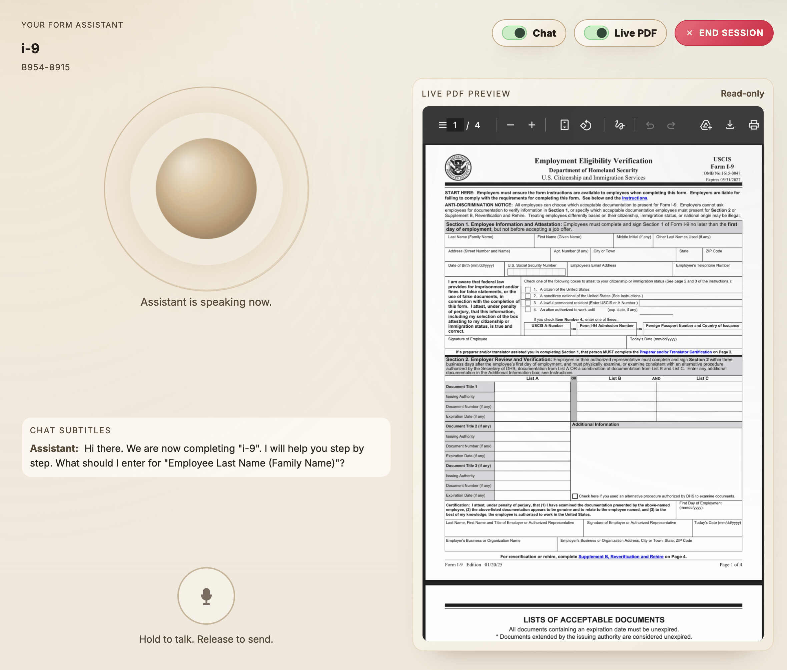
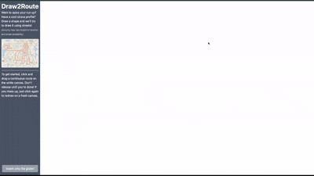
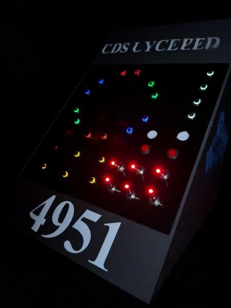
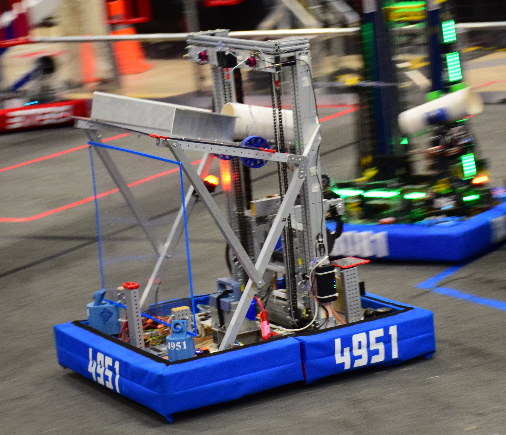

<h1>Hi, I'm Andrii!</h1>

  I'm a Mechatronics Engineering student at the <strong>University of Waterloo</strong> and a <strong>Junior Software Engineering Intern</strong> at <strong>Loadlink Technologies</strong>.

  I build practical systems across full-stack software, robotics, and embedded control.

<strong>Connect</strong>

<table>
  <tr>
    <td>
      
    </td>
    <td>
      
    </td>
  </tr>
  <tr>
    <td>
      
    </td>
    <td>
      
    </td>
  </tr>
</table>

## Highlights

<table>
  <tr>
    <td width="140" valign="top">
      
    </td>
    <td valign="top">
      <strong><a href="https://github.com/andriibessarab/skewbot">Skewbot</a></strong> 
      Autonomous Skewb-solving robot with a BFS database of 3.1M optimal solutions, web-based state scanning and normalization, and serial-controlled execution with tuned PID for sub-15s solves.  
      C++ | BFS | Bit Packing | PID Control | VEX IQ | 3D Printing | Web Interface
    </td>
  </tr>
  <tr>
    <td width="140" valign="top">
      
    </td>
    <td valign="top">
      <strong><a href="https://github.com/andriibessarab/auraforming-ai">auraforming.ai</a></strong> 
      Voice-first intake platform for businesses: upload a fillable PDF, run multilingual guided interviews, validate answers with AI, and write results back into PDFs.  
      React | Vite | Flask | SQLite | Gemini API | ElevenLabs
    </td>
  </tr>
  <tr>
    <td width="140" valign="top">
      
    </td>
    <td valign="top">
      <strong><a href="https://github.com/andriibessarab/draw2route">Draw2Route</a></strong> 
      Penalty-weighted pathfinding system that maps hand-drawn routes to OpenStreetMap nodes with projection-aware geospatial processing and real-time backend delivery. Winner of Best Use of Algorithms at RhythmHacks.  
      Python | OSMnx | OpenStreetMap | Pathfinding | Geospatial Graphs | Svelte
    </td>
  </tr>
  <tr>
    <td width="140" valign="top">
      
    </td>
    <td valign="top">
      <strong><a href="https://github.com/andriibessarab/frc-team-4951-reefscape-operator-board-firmware">Custom Robotics Controller</a></strong> 
      Designed and built a custom competition operator board end-to-end, including hardware layout, soldering, and C++ firmware, then deployed it during a record-breaking season for faster and more intuitive robot control.  
      C++ | Embedded Systems | Soldering | Electronics Design | Mechatronics
    </td>
  </tr>
  <tr>
    <td width="140" valign="top">
      
    </td>
    <td valign="top">
      <strong><a href="https://github.com/andriibessarab/frc-team-4951-reefscape-codebase">FIRST Robotics Codebase</a></strong> 
      Java competition robot codebase featuring AprilTag-based localization, autonomous path following, and a modular state system for intuitive control.  
      Java | WPILib | Computer Vision | Git
    </td>
  </tr>
</table>

  More work: <a href="https://andriibessarab.com/projects">andriibessarab.com/projects</a>

## Toolkit

<table>
  <tr>
    <td valign="top"><strong>Languages</strong></td>
    <td>
      
      
      
      
      
      
      
    </td>
  </tr>
  <tr>
    <td valign="top"><strong>Frameworks</strong></td>
    <td>
      
      
      
      
      
      
      
      
      
    </td>
  </tr>
  <tr>
    <td valign="top"><strong>Tools & Platforms</strong></td>
    <td>
      
      
    </td>
  </tr>
  <tr>
    <td valign="top"><strong>Concepts</strong></td>
    <td>
      
      
      
      
      
      
    </td>
  </tr>
</table>

---

